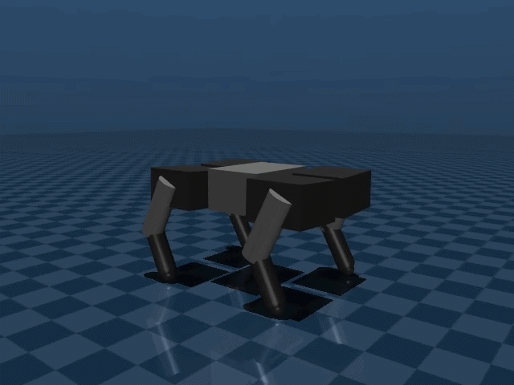
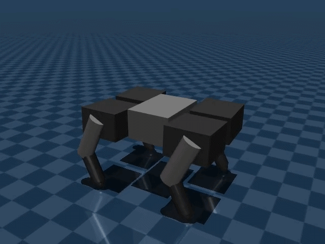
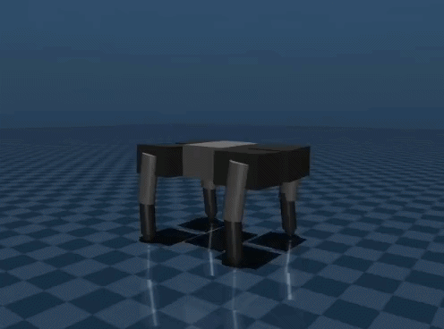
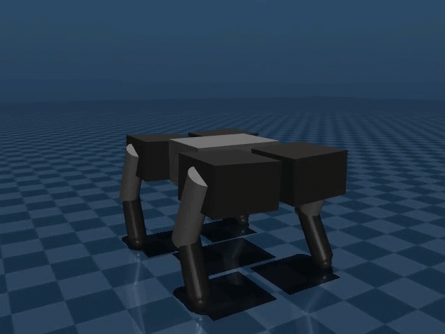

# Quadruped Simulation System

A Quadruped Simulation System that can be run for either ROS2 + Gazebo or Pure Mujoco with almost (95%) similar results in simulation, made by yours truly.

## Simulation Results (on Mujoco) 
#### Walk Simulation


#### Run Simulation


#### Jump Simulation


#### Crawl Simulation


## Installation 
If by any chance anybody needs this. then you can clone this repo onto your src/ ros2 workspace. i worked with ros2 jazzy running on Ubuntu 24.04.4 LTS.
To install ROS2 Jazzy you can follow this guide :
```
https://docs.ros.org/en/jazzy/Installation.html
```
Then create and source a Python Virtual Environment on ros2 workspace with
```
python -m venv .venv
source .venv/bin/activate
```
after that install the required libraries with pip
```
pip install pygame matplotlib numpy scipy mujoco imageio pin
```
then clone this repo if you haven't on your_ros_workspace/src
```
cd ~/your_ros_workspace/src
git clone https://github.com/1ulone/quins_ros2
```

## Running the Simulation
#### Building and Launching on ROS2
```
cd ~/your_ros_workspace
colcon build --packages-select quins
source install/setup.bash
```
then run it with 
```
ros2 launch quins master_launch.py
```

#### Building and Launching on Mujoco 
just run it using python, assuming your already inside the repo folder
```
python3 MUJOCO/MujocoSim.py
```
if by any means you would edit the .urdf for gazebo and wanted it to be used on Mujoco, then run the `convert_urdf.py` script with
```
python3 MUJOCO/convert_urdf.py
```

some other stuff are also here like the rl simulation. you can run it with python3 the visualize.py on RL folder.

soon to add isaac sim compability. and more rl stuff.

credits to these stuff : 
- https://github.com/mjbots/quad
- https://www.researchgate.net/publication/368939713_Simultaneous_locomotion_and_manipulation_control_of_quadruped_robots_using_reinforcement_learning-based_adaptive_fractional-order_sliding-mode_control
- https://pmc.ncbi.nlm.nih.gov/articles/PMC8725662/ 
